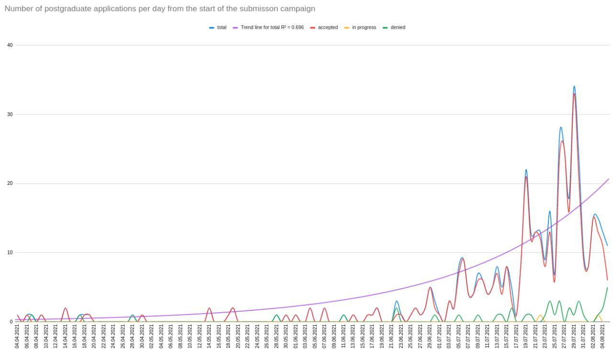

# excellent

excellent - **ex**am **cell**s cont**ent** analyzer

A tiny program for analyzing exam passing results.

## Building

```
swift build --product excellent
```

## Running

### Trace marks of a particular person

```sh
./.build/debug/excellent trace-marks Ива
```

Results:

```sh
Fetching data for user Ива...
Иванов И.И. Priority: 1; Rank: 1; Specialization mark: -; Foreign language mark: 5; Individual mark: 17
Иванов И.И. Priority: 2; Rank: -; Specialization mark: 5; Foreign language mark: 5; Individual mark: 17
Иванов И.И. (2 entries)
```

### Print number of applications per day

```sh
./.build/debug/excellent trace-applications
```

Results:

```sh
Fetching applications...
04.04.2021      0
05.04.2021      7
06.04.2021      0
07.04.2021      2
08.04.2021      0
09.04.2021      8
```

Plot drawn using the computed data in the Google Spreadsheets webapp:


